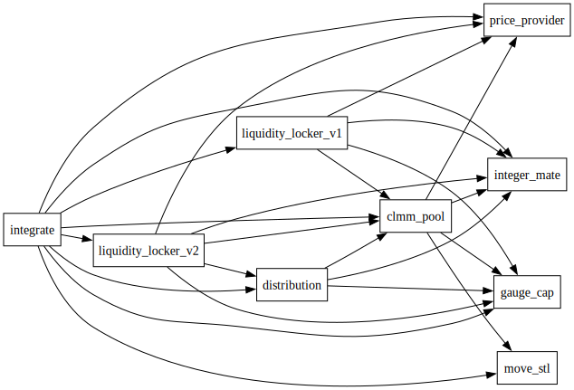

# Overview of Project - FULL_SAIL_DEX

    A Dex platform on SUI chain.

## Overview of Specific Repo - Full_Sail_SCs

A Dex Smart Contract implementing ve(3,3) model which has similar logic as [Magmafinance](https://magmafinance.io/) on sui.

The original code was decompiled from testnet contracts:

 - [config](https://testnet.suivision.xyz/package/0xf5ff7d5ba73b581bca6b4b9fa0049cd320360abd154b809f8700a8fd3cfaf7ca?tab=Code)
- [clmm_pool](https://testnet.suivision.xyz/package/0x23e0b5ab4aa63d0e6fd98fa5e247bcf9b36ad716b479d39e56b2ba9ff631e09d?tab=Code)
- [distribution](https://testnet.suivision.xyz/package/0x45ac2371c33ca0df8dc784d62c8ce5126d42edd8c56820396524dff2ae0619b1?tab=Code)
- [integrate](https://testnet.suivision.xyz/package/0x6d225cd7b90ca74b13e7de114c6eba2f844a1e5e1a4d7459048386bfff0d45df?tab=Code)
- [gauge_cap](https://testnet.suivision.xyz/package/0x05640f87c73cced090abe3c3e4738b8f0044a070be17c39ad202224298cf3784?tab=Code)

The reason why we are using this code is because it is the only ve(3,3) model on Sui and it is a good reference for us to build our own ve(3,3) model. And the code was not deployed on mainnet yet, so we had to use testnet version.

Some libraries were found opensource:
    
- [move_stl](https://github.com/MagmaFinanceIO/move-stl). No license was found.
- [integer_mate](https://github.com/MagmaFinanceIO/integer-mate). No license was found.

To mitigate the risk of of libraries becoming unavailable, we are using the code directly.

Addresses were took from the frontend [library config](https://github.com/MagmaFinanceIO/magma_clmm_sdk/blob/main/src/config/testnet.ts)

## Prerequisities

Need to have knowledge in
- Blockchain Fundamentals
- SUI chain
- Dex(Ve(3,3)) Flow and Logic
- Move Smart Contract language

## Installation Instructions

- Install SUI. You can reference this link: https://docs.sui.io/guides/developer/getting-started/sui-install
- Need to have SUI Wallet Extension or App for interacting with SUI chain by GUI

## Contract dependencies

Below is the dependency graph showing the relationships between the smart contract packages. Each arrow ("→") points from a contract to the contract it depends on. For instance, the edge

`integrate → clmm_pool`

indicates that Integrate depends on clmm_pool.

Notable dependencies:
- integrate depends on nearly all the contracts.
- fullsail_config does not depend on any contracts and none of the contracts depends on it.

## Deployment

### Initial deployment
- Use the latest version of `sui` CLI.
- Run the `build_all.sh` script to update the git deps of all the packages.
- In each package set the `[addresses]` value for your package to `0x0` in the `Move.toml` file.
- Deploy all the packages in an order defined by dependency graph (see [Contract dependencies](#contract-dependencies)). 
Use `sui client publish` command.
- In each package restore the package address `[addresses]` section the `Move.toml` with the `original-published-id` after publishing.
You can find the necessary address in the `Move.lock` in the section corresponding to the deployment environment. 
This step is required to build the packages later.

### Upgrading
- When upgrading, you need to retrieve the UpgradeCap ID of your published package. Automated address management does not track your UpgradeCap.
- When upgrading, you first need to set the `[addresses]` value for your package to 0x0 in the Move.toml, and restore its ID with the ORIGINAL-ADDRESS after upgrading.

## Latest publication artifacts

### Testnet

#### Publication transactions:

- [move_stl](https://testnet.suivision.xyz/txblock/GmnSDVgMEj9FhMBZr4KDeqbSKZmDydfbXSqgA8ToUg1C)
- [integer_mate](https://testnet.suivision.xyz/txblock/58sGFmxKmD7rdKcGWJTKvv61EjYLGn5uAELmphQ6MFga)
- [gauge_cap](https://testnet.suivision.xyz/txblock/Wi57YbH9vRspiEc9LL22NxDjxnQXTV1igShdpzKXvpD)
- [clmm_pool](https://testnet.suivision.xyz/txblock/JDixgrY2ukAH7osgCeJX8YfTeq9xSEPE68VJPmF1EBJs)
- [distribution](https://testnet.suivision.xyz/txblock/ECihTgcyGtTsQdDDs6SjC9x2616brY6jnq4sZnSQc23R)
- [integrate](https://testnet.suivision.xyz/txblock/7FhEtcJBxGJGyntVUwMkemhqgGEZZwgUL63M3xSqwDDb)
- [fullsail_config](https://testnet.suivision.xyz/txblock/6tH7SWipN55Rut3QUNhKhQo82fgWCN8Lp6JrfXnTj8t9)
