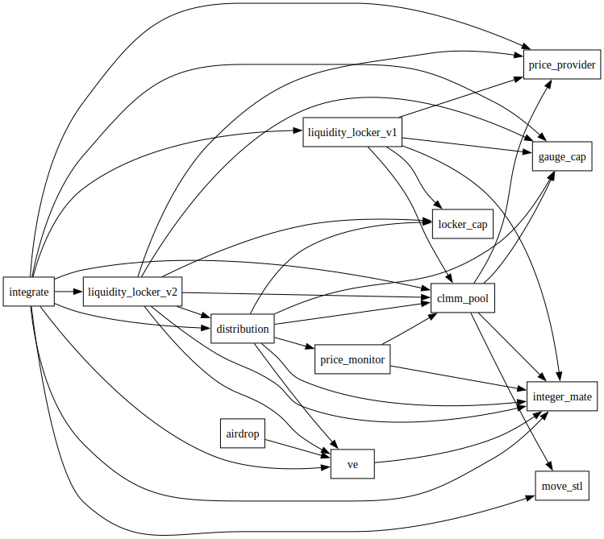

## Contract dependencies

Below is the dependency graph showing the relationships between the smart contract packages. Each arrow ("→") points from a contract to the contract it depends on. For instance, the edge

`integrate → clmm_pool`

indicates that Integrate depends on clmm_pool.

Notable dependencies:

- integrate depends on nearly all the contracts.

## Deployment

### Initial deployment

- Use the latest version of `sui` CLI.
- Run the `build_all.sh` script to update the git deps of all the packages.
- Run `reset_addresses.sh` to set the `[addresses]` value for each package to `0x0` in the `Move.toml` file.
- Deploy all the packages in an order defined by dependency graph (see [Contract dependencies](#contract-dependencies)).
  Use `sui client publish` command.
- Run `update_addresses.sh` to restore the package address `[addresses]` section in the `Move.toml` for each package with the `original-published-id` after publishing. WARNING the `update_addresses.sh` script supports only mainnet environment.

### Upgrading

- When upgrading, you need to retrieve the UpgradeCap ID of your published package. Automated address management does not track your UpgradeCap.
- When upgrading, you first need to set the `[addresses]` value for your package to 0x0 in the Move.toml, and restore its ID with the ORIGINAL-ADDRESS after upgrading.